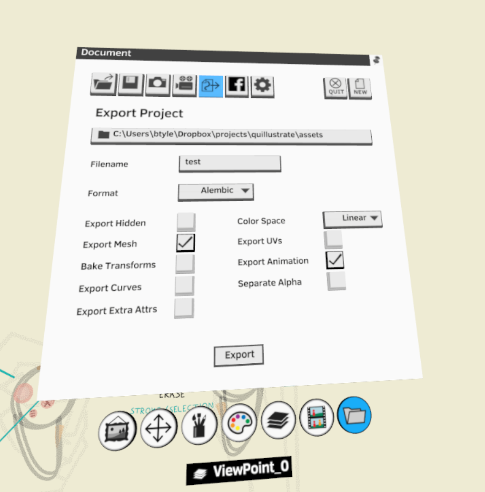

# quillustrate
Odds and ends to interface with Quill, the VR drawing application

## Installation

Requires the following executables available in path:

* blender.exe
* UE4Editor-Cmd.exe
* QuillExporter.exe


## Running

### Exporting an Alembic File from Quill (Manually)

Export an Alembic (.abc) file, selecting:

* Format: "Alembic"
* Color Space: "Linear"
* "Export Mesh"
* "Export Animation"




Save where desired.

### Importing Quill Alembic into Blender

```sh
blender.exe --background --python "quillustrate\blender.py" -- --input "assets\quill_export_example.abc"
```
